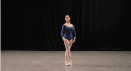
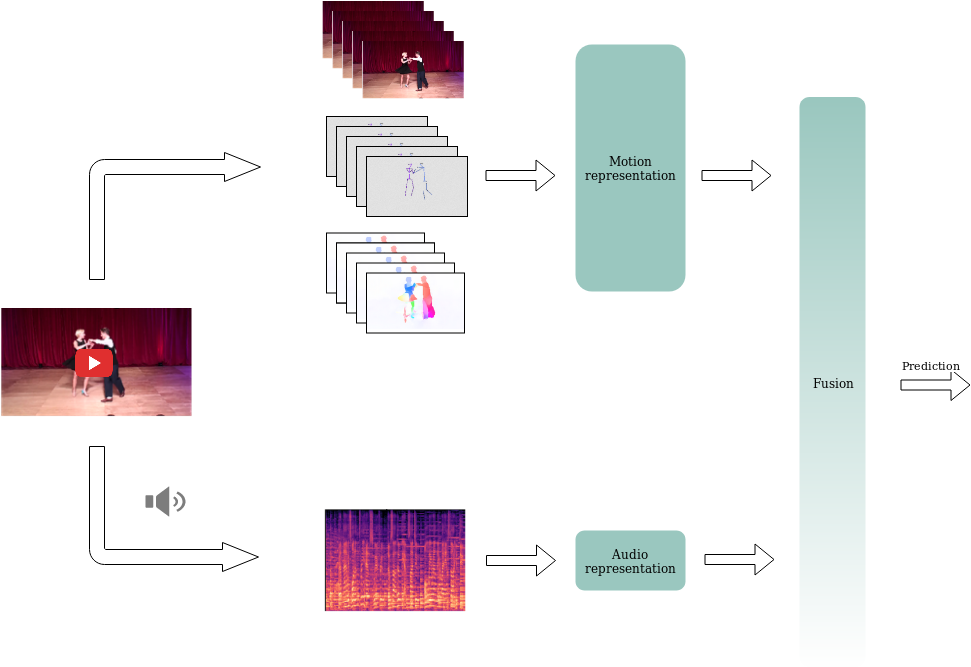

# Multimodal Dance-Recognition 



Repository for Master Thesis project. We propose the multimodal approach for dance video classification with the following pipeline:




Project structure:

/src

* notebooks - keeps jupyter notebooks for: data exploration, visualisation
and final multimodal fusion

* preprocessing - audio samples download with youtube_dll, 
spectrogram extraction, 
skeleton visualization scripts

* multimodal_net - scripts for visual and audio models' training and testing:
  * main_three_stream.py - trains and evaluates Three-Stream visual representation model
  * main_audio.py - trains and evaluates BBNN, audio representation
  * svm_fusion.py - extracts visual and audio representations, trains SVM fusion model and evaluates it

## Training and testing
#### Visual representations

  To train ThreeStreamTemporal Inception core model, in `src/multimodal_net` directory run:
  
> `python main_three_stream.py [path_to_letsdance_dir] --train_split_file datasets/letsdance_splits/train.csv --d Letsdance --test_split_file datasets/letsdance_splits/test.csv --lr 0.01`
  
  To evaluate: 
  
  `python main_three_stream.py [path_to_letsdance_dir] --train_split_file datasets/letsdance_splits/train.csv --d Letsdance --test_split_file datasets/letsdance_splits/val.csv --new_length 15 -b 1 --model_path ./checkpoints_inception_5d_addlayer/model_best.pth.tar --evaluate`
  
#### Audio representations
  To train BBNN model, in `src/multimodal_net` directory run:
  
  `python main_audio.py [path_to_letsdance_dir] --train_split_file datasets/letsdance_splits/train.csv --d Letsdance_audio --test_split_file datasets/letsdance_splits/test.csv --new_width 216 --new_height 128  --arch BBNN` 
  
  Evaluate:
  
  `python main_audio.py [path_to_letsdance_dir] --train_split_file datasets/letsdance_splits/train.csv --d Letsdance_audio --test_split_file datasets/letsdance_splits/val.csv  --new_width 216 --new_height 128  --model_path ./checkpoints_bbnn/model_best.pth.tar --arch BBNN --eval ` 

To see more options type: -h

#### Multimodal fusion

To extract representations run:

`python svm_fusion.py [path_to_letsdance_dir] --extract`

The resulting outputs are stored in pickle files in ./extracted_representations directory.

To train SVM model:

`python svm_fusion.py [path_to_letsdance_dir] --train`

NOTE: Make sure there are letsdance split files
and pth.tar files for corresponding modalities models' in default directories.
Otherwise use script arguments and provide the correct paths.

## Running on your custom dataset

To train and infer the pipeline with your custom data follow this steps:

Note: We assume you've already extracted RGB frames and audio files. 
It can be done using `FFMPEG` for instance: [ https://ffmpeg.org/].

RGB frames files naming convention:

`[clip_id]_[frame_number].jpg`,
where `frame_number` should be in format: `%04d`, starting from `0000`.

1. Prepare your dataset ROOT_Dir as according to the pattern given below:
```
    ├── rgb                         # RGB frames
        |── [class1..]
        |── [class2..]
    ├── flow_png                    # Flow frames
    ├── audio_mfcc                  # Mel_spectrograms
    ├── densepose                   # Visualised skeletons
```
Alternatively you can write your own dataloader add modify it according to your needs.

#### Extract Flow frames

2. Use FlowNet2.0 dockerized version to extract Flow frames. Follow steps in:
[https://github.com/lmb-freiburg/flownet2-docker]

#### Extract Skeleton frames
3. Use Densepose to extract and visualize skeletons: 
[https://github.com/facebookresearch/Densepose]

Note: make sure you stick to the same naming convention in each of the visual 
representations directories. Meaning corresponding frames in each of the
directories (rgb, flow_png, densepose) have the same names. 

-------

4. Prepare csv file with `label clip_id duration(in frames)`. Exemplary entry:

`waltz	-2W1PfHleRM_033	301`

You can see the examples of correct `.csv` files in `datasets/letsdance_splits/ directory.

#### Extract Mel-spectrograms
4. To extract mel-spectrograms use a script provided in `preprocessing` directory. Run:

`python mffc_extraction.py --root_dir [path to extracted audio files root directory]
--output_dir [path to the directory where corresponding mel_spectrograms should be saved]
--csv_file [path to the .csv file with given samples]`

----
5. Split your .csv file to *train*, *test* and *val* sets. 
6. Proceed with following the steps  in *Training and testing* .


